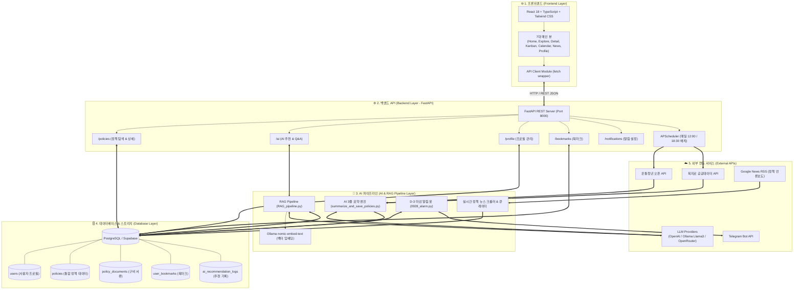
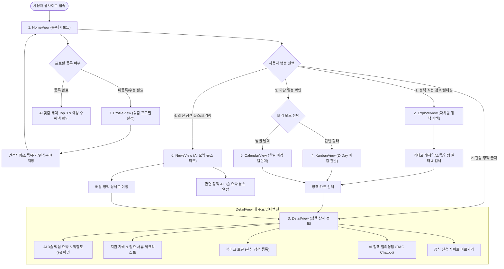
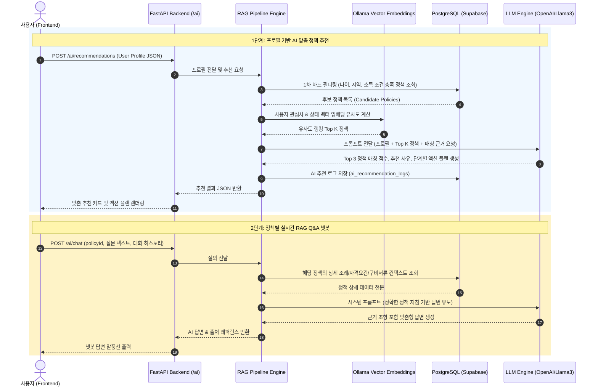
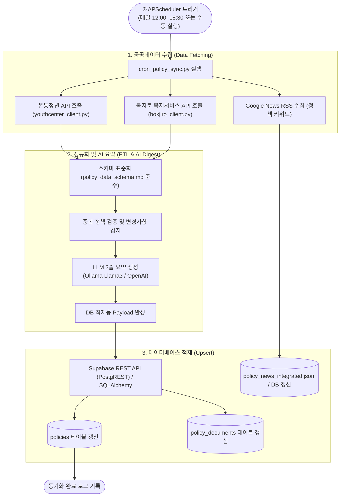
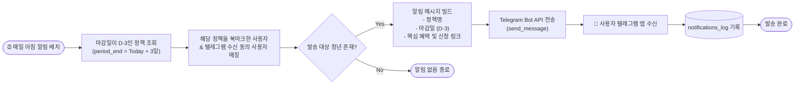
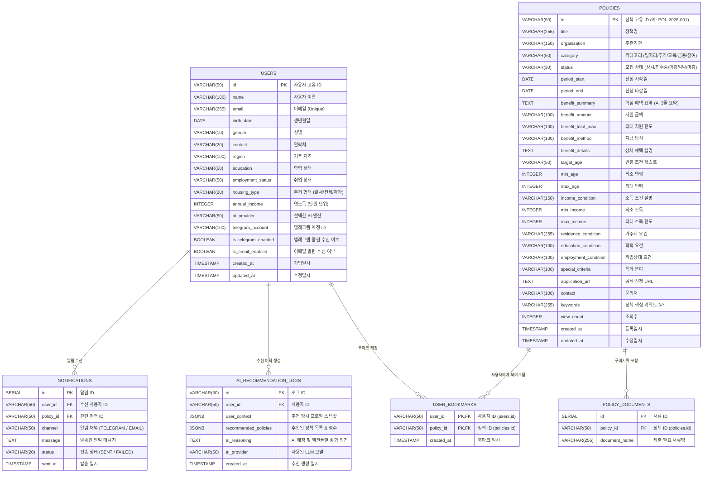

# 🧭 청년나침반 (Youth Compass) - 프로젝트 플로우차트 & 아키텍처 가이드

> **프로젝트명**: 청년나침반 (Youth Compass / 청년큐레이터)  
> **프로젝트 개요**: 2025-2026 대한민국 청년 맞춤 정책 탐색 & AI 추천·분석 플랫폼  
> **문서 버전**: v1.0.0  
> **최종 작성일**: 2026-10-04  

---

## 📌 목차
1. [전체 시스템 아키텍처 (System Architecture)](#1-전체-시스템-아키텍처-system-architecture)
2. [사용자 서비스 플로우 (User Journey & View Flow)](#2-사용자-서비스-플로우-user-journey--view-flow)
3. [AI 맞춤 추천 & RAG 질의응답 플로우 (AI & RAG Pipeline)](#3-ai-맞춤-추천--rag-질의응답-플로우-ai--rag-pipeline)
4. [공공데이터 수집 및 배치 스케줄러 플로우 (Data Ingestion & Sync)](#4-공공데이터-수집-및-배치-스케줄러-플로우-data-ingestion--sync)
5. [D-3 마감 임박 알림 서비스 플로우 (Notification Flow)](#5-d-3-마감-임박-알림-서비스-플로우-notification-flow)
6. [데이터베이스 엔티티 관계도 (Database ERD)](#6-데이터베이스-엔티티-관계도-database-erd)

---

## 1. 전체 시스템 아키텍처 (System Architecture)

청년나침반 서비스는 **Frontend (React)**, **Backend (FastAPI)**, **AI & RAG Engine (Python/LLM)**, **Database (PostgreSQL / Supabase)** 및 **외부 공공 API/LLM 제공자**로 유기적으로 연결되어 있습니다.

---

## 2. 사용자 서비스 플로우 (User Journey & View Flow)

사용자가 웹 애플리케이션에 접속하여 맞춤 정책을 추천받고, 탐색, 캘린더 관리, AI 상담까지 진행하는 단계별 흐름입니다.

---

## 3. AI 맞춤 추천 & RAG 질의응답 플로우 (AI & RAG Pipeline)

사용자의 개인 특성(연령, 소득, 지역, 취업상태 등)을 기반으로 자격 요건을 판별하고, 벡터 유사도 검색과 LLM을 통해 최적의 정책 및 액션 플랜을 도출합니다.

---

## 4. 공공데이터 수집 및 배치 스케줄러 플로우 (Data Ingestion & Sync)

온통청년 및 복지로의 공공 API를 통해 신규 및 변경 정책 데이터를 주기적으로 수집하고, LLM을 통해 표준화 및 3줄 요약을 거쳐 DB에 반영합니다.

---

## 5. D-3 마감 임박 알림 서비스 플로우 (Notification Flow)

사용자가 북마크하거나 관심 등록한 정책 중 마감일이 3일 남은 정책을 자동으로 감지하여 텔레그램 메신저로 푸시 알림을 발송합니다.

---

## 6. 데이터베이스 엔티티 관계도 (Database ERD)

데이터베이스의 주요 테이블 구조와 외래키(FK) 참조 관계입니다.

---

## 7. 팀별 역할 및 파이프라인 매핑 요약

| 팀 역할 | 주요 코드 경로 | 핵심 담당 프로세스 |
| :--- | :--- | :--- |
| **🌐 Frontend** | `src/` (`App.tsx`, `views/`, `components/`) | 7개 뷰 UI/UX, 필터링 및 캘린더 인터랙션, AI 대화 인터페이스 |
| **⚙️ Backend** | `backend/` (`app/routers/`, `app/services/`) | RESTful API 엔드포인트 제공, 스케줄러 오케스트레이션, DB 트랜잭션 |
| **🤖 LLM AI** | `ai/` (`RAG_pipeline.py`, `summarize_and_save_policies.py`) | 정책 3줄 요약, 벡터 임베딩(Ollama), RAG 정책 Q&A 및 매칭 추천 |
| **🗄️ DB & Data** | `db/` (`schema.sql`, `fetch_youth_policies.py`) | DB 스키마 설계 및 인덱싱, 공공데이터 API 크롤러 및 데이터 적재 |
