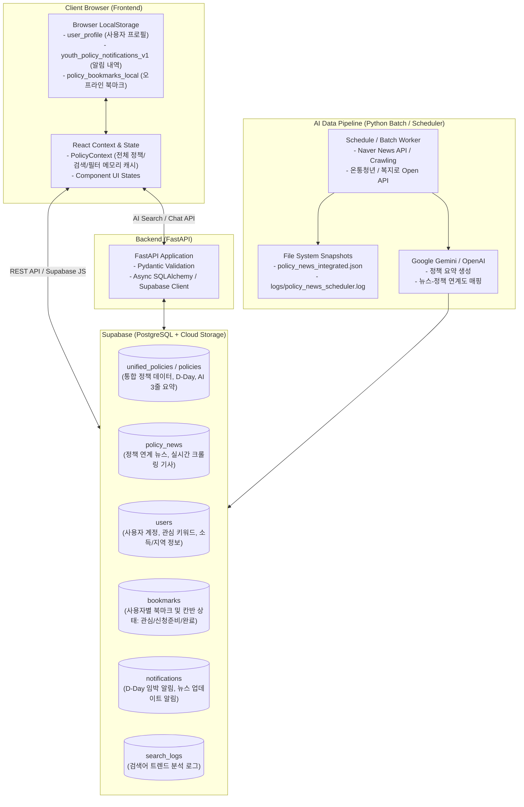

# 📋 프로젝트 파일별 작업 내용 및 저장 정책 명세서 (Project File Specifications & Storage Policies)

본 문서는 청년 정책 플랫폼(Project 2)의 전체 프로젝트 구조, 파일별 상세 기능/작업 내용, 그리고 프론트엔드·백엔드·AI 파이프라인·데이터베이스 전반에 걸친 **데이터 저장 및 관리 정책(Storage & State Policy)**을 체계적으로 정리한 문서입니다.

---

## 📑 목차 (Table of Contents)
1. [전체 시스템 저장 및 상태 관리 정책 (Global Storage Policy)](#1-전체-시스템-저장-및-상태-관리-정책-global-storage-policy)
2. [루트 디렉터리 및 환경 설정 파일 (`/`)](#2-루트-디렉터리-및-환경-설정-파일-)
3. [프론트엔드 모듈 (`src/`)](#3-프론트엔드-모듈-src)
   - [3.1 엔트리 및 코어 (Core)](#31-엔트리-및-코어-core)
   - [3.2 API & 데이터 레이어 (`src/api`, `src/lib`)](#32-api--데이터-레이어-srcapi-srclib)
   - [3.3 전역 상태 & 스토리지 유틸리티 (`src/context`, `src/utils`)](#33-전역-상태--스토리지-유틸리티-srccontext-srcutils)
   - [3.4 타입 정의 (`src/types`)](#34-타입-정의-srctypes)
   - [3.5 컴포넌트 (`src/components`)](#35-컴포넌트-srccomponents)
   - [3.6 뷰/페이지 (`src/views`)](#36-뷰페이지-srcviews)
4. [백엔드 모듈 (`backend/`)](#4-백엔드-모듈-backend)
   - [4.1 서버 코어 및 DB 설정 (`backend/app/core`, `database.py`, `main.py`)](#41-서버-코어-및-db-설정-backendappcore-databasepy-mainpy)
   - [4.2 API 라우터 (`backend/app/routers`)](#42-api-라우터-backendapprouters)
   - [4.3 데이터 모델 & Pydantic 스키마 (`backend/app/models`, `schemas`)](#43-데이터-모델--pydantic-스키마-backendappmodels-schemas)
   - [4.4 CRUD & 비즈니스 서비스 (`backend/app/crud`, `services`)](#44-crud--비즈니스-서비스-backendappcrud-services)
   - [4.5 DB 초기화 및 관리 스크립트 (`backend/`, `backend/scripts`)](#45-db-초기화-및-관리-스크립트-backend-backendscripts)
5. [AI 및 데이터 파이프라인 모듈 (`ai/`, `db/`)](#5-ai-및-데이터-파이프라인-모듈-ai-db)
   - [5.1 정책 수집 및 외부 API 클라이언트](#51-정책-수집-및-외부-api-클라이언트)
   - [5.2 AI 파이프라인 (요약, 뉴스 매핑, RAG, Supabase 적재)](#52-ai-파이프라인-요약-뉴스-매핑-rag-supabase-적재)
   - [5.3 스케줄러 및 데이터 동기화](#53-스케줄러-및-데이터-동기화)
   - [5.4 DB 스키마 및 마이그레이션 (`db/`)](#54-db-스키마-및-마이그레이션-db)
6. [배치 스크립트 및 로그 (`scripts/`, `logs/`, `docs/`)](#6-배치-스크립트-및-로그-scripts-logs-docs)

---

## 1. 전체 시스템 저장 및 상태 관리 정책 (Global Storage Policy)

### 1.1 저장소별 데이터 격리 및 영속성 정책

| 저장소 분류 | 저장 항목 / 키 이름 | 영속성 (Lifecycle) | 설명 및 관리 정책 |
| :--- | :--- | :--- | :--- |
| **Browser LocalStorage** | `user_profile` | 영구 (사용자 초기화 전까지) | 사용자 연령, 거주지, 학력, 취업상태, 관심 카테고리 저장 (비로그인 상태 맞춤 추천에 사용) |
| **Browser LocalStorage** | `youth_policy_notifications_v1` | 영구 (배열 관리) | D-Day 임박 알림, 새 뉴스 연계 알림 내역 및 읽음 여부(`read: boolean`) 저장 |
| **Browser LocalStorage** | `policy_bookmarks_local` | 영구 (백엔드 미연동 시 백업용) | 북마크 ID 및 칸반 진행단계(`saved`, `preparing`, `applied`) 오프라인 상태 저장 |
| **Supabase DB (PostgreSQL)** | `unified_policies` | 영구 보관 (주기적 갱신) | 온통청년, 복지로 등 다중 소스 통합 데이터. AI 요약(`ai_summary`), 지원 자격, 접수 기간 등 저장 |
| **Supabase DB (PostgreSQL)** | `policy_news` | 영구 보관 (자동 인덱싱) | 네이버 뉴스 크롤링 기사 데이터. `policy_id`, `policy_title`, `summary`, `published_at` 연계 저장 |
| **Supabase DB (PostgreSQL)** | `users`, `bookmarks`, `notifications` | 영구 보관 (RDBMS) | 사용자 인증 계정, 정책 찜 목록, 개인화 푸시/스케줄 알림 기록 관리 |
| **Local File System (JSON/Log)** | `db/policy_news_integrated.json` | 버전 관리/스냅샷 | 크롤링 및 AI 매핑 결과의 오프라인 로컬 백업 스냅샷 |
| **Local File System (JSON/Log)** | `logs/policy_news_scheduler.log` | 운영 로그 (Append-only) | 뉴스 수집 스케줄러 실행 주기, 수집 건수, 에러 로그 기록 |

---

## 2. 루트 디렉터리 및 환경 설정 파일 (`/`)

| 파일 경로 | 파일명 | 작업 내용 및 역할 | 저장/보관 정책 |
| :--- | :--- | :--- | :--- |
| `/.env` | `.env` | Supabase URL, Anon Key, Service Key, API Key 등 민감 정보 정의 | 로컬 환경 전용, `.gitignore` 필수 포함 |
| `/.env.example` | `.env.example` | 개발에 필요한 환경변수 템플릿 제공 | Git 버전 관리 저장 |
| `/package.json` | `package.json` | React 18, Vite, Lucide-react, TailwindCSS, Supabase-js 등 프론트엔드 의존성 및 스크립트 정의 | 패키지 설정 저장 |
| `/vite.config.ts` | `vite.config.ts` | Vite 빌드 및 개발 서버 설정 (HMR, 포트 설정) | 빌드 설정 파일 |
| `/tailwind.config.js` | `tailwind.config.js` | 프로젝트 테마(색상 팔레트, 폰트, 반응형 브레이크포인트) 정의 | CSS 프레임워크 설정 |
| `/postcss.config.js` | `postcss.config.js` | TailwindCSS 및 Autoprefixer 플러그인 연동 | CSS 컴파일러 설정 |
| `/tsconfig.json` | `tsconfig.json` | TypeScript 컴파일 옵션 및 경로 Alias 설정 | TS 컴파일 설정 |
| `/schema.sql` | `schema.sql` | 최상위 DB DDL 스키마 (통합 정책, 뉴스, 사용자, 북마크 테이블 생성 쿼리) | DB 스키마 형상 관리 |
| `/FLOWCHART.md` | `FLOWCHART.md` | 프로젝트 전체 아키텍처 및 데이터 흐름도 다이어그램 | 문서 |
| `/DESIGN.md` | `DESIGN.md` | UI/UX 디자인 시스템, 색상 토큰, 타이포그래피 가이드라인 | 문서 |
| `/README.md` | `README.md` | 프로젝트 개요, 설치/실행 가이드 및 기능 소개 | 문서 |

---

## 3. 프론트엔드 모듈 (`src/`)

### 3.1 엔트리 및 코어 (Core)
* **[src/main.tsx](file:///c:/workAi/project2/src/main.tsx)**: React DOM 렌더링 엔트리포인트. `PolicyProvider`를 주입하여 전역 정책 상태 전달.
* **[src/App.tsx](file:///c:/workAi/project2/src/App.tsx)**: 탭 기반 네비게이션 관리 (`home`, `explore`, `calendar`, `kanban`, `news`, `profile`, `detail`). 전역 알림 모달, 토스트, 북마크 상태 제어.
* **[src/index.css](file:///c:/workAi/project2/src/index.css)**: 글로벌 폰트(Pretendard), Tailwind 유틸리티 및 커스텀 스크롤바, 애니메이션 정의.

### 3.2 API & 데이터 레이어 (`src/api`, `src/lib`)
* **[src/lib/supabase.ts](file:///c:/workAi/project2/src/lib/supabase.ts)**: Supabase 클라이언트 싱글톤 인스턴스 초기화. 환경변수 `VITE_SUPABASE_URL`, `VITE_SUPABASE_ANON_KEY` 바인딩.
* **[src/api/supabasePolicies.ts](file:///c:/workAi/project2/src/api/supabasePolicies.ts)**: Supabase 테이블(`unified_policies`, `policy_news`)과의 직접 비동기 통신. 
  - `fetchSupabasePolicies()`: 정책 데이터 조회 및 D-Day 계산 매핑.
  - `fetchSupabaseNews()`: 정책 연계 뉴스 기사 목록 조회.
  - `toggleSupabaseBookmark()`: 북마크 DB 동기화.
* **[src/api/client.ts](file:///c:/workAi/project2/src/api/client.ts)**: FastAPI 백엔드와의 REST 통신 클라이언트 (AI 챗봇, RAG 검색 연동용).
* **[src/api/mockData.ts](file:///c:/workAi/project2/src/api/mockData.ts)**: Supabase 연결 실패 또는 오프라인 테스트 시 폴백(Fallback)용 목업 데이터 세트.

### 3.3 전역 상태 & 스토리지 유틸리티 (`src/context`, `src/utils`)
* **[src/context/PolicyContext.tsx](file:///c:/workAi/project2/src/context/PolicyContext.tsx)**:
  - **작업 내용**: 전체 정책 목록, 로딩 상태, 검색어(`searchTerm`), 필터 조건(지역, 분야, 연령 등)을 관리하는 React Context.
  - **저장 정책**: 메모리(React State) 캐싱. 초기 구동 시 Supabase로부터 로드.
* **[src/utils/profileStorage.ts](file:///c:/workAi/project2/src/utils/profileStorage.ts)**:
  - **작업 내용**: 사용자 프로필 정보(나이, 지역, 학력, 취업상태, 관심분야) 읽기/쓰기 유틸리티.
  - **저장 정책**: 브라우저 `localStorage` 키 `user_profile`에 JSON 문자열로 저장.
* **[src/utils/notificationStorage.ts](file:///c:/workAi/project2/src/utils/notificationStorage.ts)**:
  - **작업 내용**: D-Day 임박(D-3, D-7), 실시간 뉴스 연계 알림 생성 및 읽음 처리.
  - **저장 정책**: 브라우저 `localStorage` 키 `youth_policy_notifications_v1`에 저장 (최대 50건 유지).
* **[src/utils/policyMatcher.ts](file:///c:/workAi/project2/src/utils/policyMatcher.ts)**:
  - **작업 내용**: 사용자 프로필 조건과 정책의 신청 자격(연령 범위, 거주 지역 등)을 매칭하여 일치율(Match Score) 계산.
* **[src/utils/regionData.ts](file:///c:/workAi/project2/src/utils/regionData.ts)**:
  - **작업 내용**: 전국 17개 시도 및 하위 시·군·구 메타데이터 정의.

### 3.4 타입 정의 (`src/types`)
* **[src/types/policy.ts](file:///c:/workAi/project2/src/types/policy.ts)**: 정책(`UnifiedPolicy`, `Policy`), 뉴스(`PolicyNewsItem`), 필터 옵션 인터페이스 정의.
* **[src/types/user.ts](file:///c:/workAi/project2/src/types/user.ts)**: 사용자 프로필(`UserProfile`), 칸반 단계(`KanbanStatus`) 정의.
* **[src/types/api.ts](file:///c:/workAi/project2/src/types/api.ts)**: API 응답 및 에러 표준 포맷 정의.

### 3.5 컴포넌트 (`src/components`)
* **[src/components/Header.tsx](file:///c:/workAi/project2/src/components/Header.tsx)**: 메인 상단 네비게이션 바, 알림 벨 아이콘 (안읽은 알림 뱃지 표시), 탭 전환 버튼.
* **[src/components/NotificationModal.tsx](file:///c:/workAi/project2/src/components/NotificationModal.tsx)**: D-Day 임박 및 뉴스 연계 알림 팝업. 개별 읽음 및 전체 읽음 처리 지원.
* **[src/components/PolicyCard.tsx](file:///c:/workAi/project2/src/components/PolicyCard.tsx)**: 정책 카드 UI. D-Day 뱃지, AI 3줄 요약 프리뷰, 북마크 토글 기능.
* **[src/components/AIDigest.tsx](file:///c:/workAi/project2/src/components/AIDigest.tsx)**: AI가 핵심만 추출한 3줄 요약 및 추천 사유 하이라이트 박스.
* **[src/components/ApplyStepList.tsx](file:///c:/workAi/project2/src/components/ApplyStepList.tsx)**: 신청 절차(서류준비 -> 온라인 접수 -> 심사 -> 발표) 단계별 시각화.
* **[src/components/DDayBadge.tsx](file:///c:/workAi/project2/src/components/DDayBadge.tsx)**: 접수 마감까지 남은 일수 계산에 따른 조건부 컬러 뱃지 (마감임박: 빨강, 진행중: 파랑, 상시: 초록).
* **[src/components/FilterModal.tsx](file:///c:/workAi/project2/src/components/FilterModal.tsx)**: 지역, 정책 카테고리, 연령대, 고용상태 등 다중 조건 필터 모달.
* **[src/components/SearchBar.tsx](file:///c:/workAi/project2/src/components/SearchBar.tsx)**: 실시간 정책 검색 입력창 및 최근 검색어 지원.
* **[src/components/Toast.tsx](file:///c:/workAi/project2/src/components/Toast.tsx)**: 사용자 액션 피드백 알림 토스트 메시지.
* **[src/components/Footer.tsx](file:///c:/workAi/project2/src/components/Footer.tsx)**: 하단 푸터 영역 및 데이터 출처 표기.

### 3.6 뷰/페이지 (`src/views`)
* **[src/views/HomeView.tsx](file:///c:/workAi/project2/src/views/HomeView.tsx)**:
  - 메인 홈 대시보드.
  - 사용자 맞춤 추천 정책, 마감 임박 정책(D-Day Top 5), 최신 정책 뉴스 피드 노출.
* **[src/views/ExploreView.tsx](file:///c:/workAi/project2/src/views/ExploreView.tsx)**:
  - 전체 정책 탐색 및 조건별 검색 페이지.
  - 카테고리 탭, 상세 필터, 정렬(최신순/마감임박순/인기순) 기능.
* **[src/views/DetailView.tsx](file:///c:/workAi/project2/src/views/DetailView.tsx)**:
  - 정책 상세 페이지.
  - AI 3줄 핵심 요약, 지원 대상 자격표, 연계 뉴스 기사 리스트, 신청 공식 링크 연결, 캘린더/칸반 담기 기능.
* **[src/views/CalendarView.tsx](file:///c:/workAi/project2/src/views/CalendarView.tsx)**:
  - 월간/주간 캘린더 인터페이스.
  - 찜한 정책 및 관심 정책의 접수 시작일/마감일을 일정으로 시각화.
* **[src/views/KanbanView.tsx](file:///c:/workAi/project2/src/views/KanbanView.tsx)**:
  - 정책 신청 관리 칸반 보드 (`관심 정책` -> `신청 준비중` -> `신청 완료`).
  - 드래그 앤 드롭 또는 상태 변경을 통해 저장 정책 관리.
* **[src/views/NewsView.tsx](file:///c:/workAi/project2/src/views/NewsView.tsx)**:
  - 정책별 최신 뉴스 및 언론 보도 큐레이션 뷰.
  - AI 뉴스 요약 및 관련 정책 바로가기 링크 제공.
* **[src/views/ProfileView.tsx](file:///c:/workAi/project2/src/views/ProfileView.tsx)**:
  - 사용자 맞춤 조건 설정 (생년월일, 거주지역, 취업상태, 소득구간 등).
  - 로컬 스토리지에 프로필 동기화.

---

## 4. 백엔드 모듈 (`backend/`)

### 4.1 서버 코어 및 DB 설정 (`backend/app/core`, `database.py`, `main.py`)
* **[backend/app/main.py](file:///c:/workAi/project2/backend/app/main.py)**: FastAPI 애플리케이션 생성, CORS 미들웨어 구성, API 라우터 등록.
* **[backend/app/database.py](file:///c:/workAi/project2/backend/app/database.py)**: SQLAlchemy 비동기/동기 DB 엔진 및 세션 팩토리(`SessionLocal`) 설정.
* **[backend/app/core/config.py](file:///c:/workAi/project2/backend/app/core/config.py)**: Pydantic BaseSettings 기반 환경변수 로딩 (`SUPABASE_URL`, `API_KEYS` 등).
* **[backend/app/core/supabase.py](file:///c:/workAi/project2/backend/app/core/supabase.py)**: 백엔드용 Supabase Admin Client 초기화.

### 4.2 API 라우터 (`backend/app/routers`)
* **[backend/app/routers/ai.py](file:///c:/workAi/project2/backend/app/routers/ai.py)**: Gemini/OpenAI 기반 정책 질의응답(RAG) 및 맞춤 추천 엔드포인트 (`POST /api/ai/ask`).
* **[backend/app/routers/policies.py](file:///c:/workAi/project2/backend/app/routers/policies.py)**: 정책 목록 조회, 상세 조회, 검색/필터링 엔드포인트.
* **[backend/app/routers/news.py](file:///c:/workAi/project2/backend/app/routers/news.py)**: 정책 연계 뉴스 목록 및 상세 조회 엔드포인트.
* **[backend/app/routers/users.py](file:///c:/workAi/project2/backend/app/routers/users.py)**: 사용자 프로필 등록, 수정 및 설정 조회.
* **[backend/app/routers/bookmarks.py](file:///c:/workAi/project2/backend/app/routers/bookmarks.py)**: 사용자 북마크 등록/해제 및 칸반 진행단계 갱신.
* **[backend/app/routers/notifications.py](file:///c:/workAi/project2/backend/app/routers/notifications.py)**: 알림 목록 조회 및 읽음 처리.

### 4.3 데이터 모델 & Pydantic 스키마 (`backend/app/models`, `schemas`)
* **[backend/app/models/unified_policy.py](file:///c:/workAi/project2/backend/app/models/unified_policy.py)**: 통합 정책 SQLAlchemy ORM 모델 (`unified_policies` 테이블 매핑).
* **[backend/app/models/news.py](file:///c:/workAi/project2/backend/app/models/news.py)**: 정책 뉴스 ORM 모델 (`policy_news` 테이블 매핑).
* **[backend/app/models/user.py](file:///c:/workAi/project2/backend/app/models/user.py)**: 사용자 계정 및 프로필 ORM 모델.
* **[backend/app/models/bookmark.py](file:///c:/workAi/project2/backend/app/models/bookmark.py)**: 북마크 및 칸반 상태 ORM 모델.
* **[backend/app/models/notification.py](file:///c:/workAi/project2/backend/app/models/notification.py)**: 푸시/시스템 알림 ORM 모델.
* **[backend/app/schemas/*](file:///c:/workAi/project2/backend/app/schemas)**: 요청/응답 검증용 Pydantic 스키마 (`PolicyResponse`, `UserCreate`, `NewsItem` 등).

### 4.4 CRUD & 비즈니스 서비스 (`backend/app/crud`, `services`)
* **[backend/app/crud/*](file:///c:/workAi/project2/backend/app/crud)**: 각 도메인별(정책, 사용자, 북마크, 알림) 데이터베이스 쿼리 레이어.
* **[backend/app/services/*](file:///c:/workAi/project2/backend/app/services)**: 알림 발송 서비스, 정책 매칭 알고리즘 서비스 로직.

### 4.5 DB 초기화 및 관리 스크립트 (`backend/`, `backend/scripts`)
* **[backend/create_unified_policies_table.py](file:///c:/workAi/project2/backend/create_unified_policies_table.py)**: `unified_policies` 테이블 DDL 실행 스크립트.
* **[backend/insert_unified_policies.py](file:///c:/workAi/project2/backend/insert_unified_policies.py)**: 가공된 정책 데이터를 Supabase DB에 배치 삽입.
* **[backend/create_notifications_table.py](file:///c:/workAi/project2/backend/create_notifications_table.py)**: `notifications` 테이블 생성 스크립트.
* **[backend/cron_policy_fetch.py](file:///c:/workAi/project2/backend/cron_policy_fetch.py)**: 백엔드 주기적 정책 수집 크론잡.

---

## 5. AI 및 데이터 파이프라인 모듈 (`ai/`, `db/`)

### 5.1 정책 수집 및 외부 API 클라이언트
* **[ai/youthcenter_client.py](file:///c:/workAi/project2/ai/youthcenter_client.py)** / **[fetch_youth_policies.py](file:///c:/workAi/project2/fetch_youth_policies.py)**:
  - **작업 내용**: 온통청년(YouthCenter) Open API와 통신하여 전국 청년정책 XML/JSON 데이터 수집.
  - **저장 정책**: 수집된 원본 데이터를 메모리 로딩 후 가공 파이프라인으로 전달.
* **[ai/bokjiro_client.py](file:///c:/workAi/project2/ai/bokjiro_client.py)**:
  - **작업 내용**: 복지로(Bokjiro) 사회보장정보 Open API 연동 클라이언트.

### 5.2 AI 파이프라인 (요약, 뉴스 매핑, RAG, Supabase 적재)
* **[ai/client.py](file:///c:/workAi/project2/ai/client.py)**:
  - **작업 내용**: Google Gemini (`google-genai` / `gemini-1.5-flash` / `gemini-2.0-flash`) 및 OpenAI 클라이언트 래퍼.
* **[ai/summarize_and_save_policies.py](file:///c:/workAi/project2/ai/summarize_and_save_policies.py)**:
  - **작업 내용**: 복잡한 공고문을 LLM 프롬프트에 전달하여 3줄 핵심 요약 및 대상자 자격 조건을 정형화.
* **[ai/policy_news_pipeline.py](file:///c:/workAi/project2/ai/policy_news_pipeline.py)**:
  - **작업 내용**: 네이버 뉴스 API를 통해 각 정책별 키워드로 기사를 검색/수집하고, 기사 본문 요약 및 정책 매핑을 수행하여 로컬 JSON 스냅샷(`db/policy_news_integrated.json`) 생성.
  - **저장 정책**: 파일 시스템에 JSON 스냅샷 저장 및 Supabase `policy_news` 테이블에 동시 적재.
* **[ai/RAG_pipeline.py](file:///c:/workAi/project2/ai/RAG_pipeline.py)**:
  - **작업 내용**: 정책 데이터의 벡터 임베딩 생성 및 유사도 검색 기반 RAG 파이프라인.
* **[ai/save_to_supabase.py](file:///c:/workAi/project2/ai/save_to_supabase.py)**:
  - **작업 내용**: 전처리 완료된 정책 및 뉴스 데이터를 Supabase REST API를 통해 Upsert(중복 시 업데이트) 실행.

### 5.3 스케줄러 및 데이터 동기화
* **[ai/policy_news_sync.py](file:///c:/workAi/project2/ai/policy_news_sync.py)**:
  - **작업 내용**: 로컬 JSON 백업본과 Supabase DB 간의 뉴스 데이터 무결성 동기화 1회 실행기.
* **[ai/policy_news_scheduler.py](file:///c:/workAi/project2/ai/policy_news_scheduler.py)**:
  - **작업 내용**: 백그라운드에서 주기적(기본 6시간)으로 뉴스 크롤링, AI 요약, Supabase Upsert를 무한 루프로 수행하는 데몬 스케줄러.
  - **저장 정책**: 실행 주기별 상태와 성공/실패 내역을 `logs/policy_news_scheduler.log`에 저장.

### 5.4 DB 스키마 및 마이그레이션 (`db/`)
* **[db/schema.sql](file:///c:/workAi/project2/db/schema.sql)**:
  - **작업 내용**: Supabase PostgreSQL 테이블 정의서 (`unified_policies`, `policy_news`, `users`, `bookmarks`, `notifications`, `search_logs`). 인덱스(Index) 및 외래키(FK) 설정 포함.
* **[db/policy_news_integrated.json](file:///c:/workAi/project2/db/policy_news_integrated.json)**:
  - **작업 내용**: 정책-뉴스 연계 데이터의 오프라인 JSON 백업 스냅샷.
* **[db/seed_to_supabase.py](file:///c:/workAi/project2/db/seed_to_supabase.py)** / **[db/seeds/](file:///c:/workAi/project2/db/seeds)**:
  - **작업 내용**: 초기 구동 및 테스트를 위한 정책 목업 시드 데이터 주입 스크립트.

---

## 6. 배치 스크립트 및 로그 (`scripts/`, `logs/`, `docs/`)

* **[scripts/run_news_sync.bat](file:///c:/workAi/project2/scripts/run_news_sync.bat)**: Windows 환경에서 정책-뉴스 즉시 동기화 파이썬 스크립트(`ai/policy_news_sync.py`)를 원클릭 실행하는 배치 파일.
* **[scripts/start_news_scheduler.bat](file:///c:/workAi/project2/scripts/start_news_scheduler.bat)**: 백그라운드 자동 수집 스케줄러(`ai/policy_news_scheduler.py`)를 가동하는 배치 파일.
* **[logs/policy_news_scheduler.log](file:///c:/workAi/project2/logs/policy_news_scheduler.log)**: 뉴스 스케줄러의 타임스탬프별 실행 결과, 수집 건수, API 통신 에러 로그.
* **[docs/api_spec.md](file:///c:/workAi/project2/docs/api_spec.md)** / **[docs/supabase_data_integration.md](file:///c:/workAi/project2/docs/supabase_data_integration.md)**: 백엔드 API 명세서 및 Supabase 연동 아키텍처 기술 문서.

---

## 7. 요약 정리 (Summary)

1. **데이터 영속성 원칙**:
   - **사용자 개인화 및 오프라인 상태**: 브라우저 `localStorage`를 최우선으로 사용하여 로그인 없는 환경에서도 끊김 없는 맞춤 추천 및 알림 경험 제공.
   - **핵심 데이터 (정책, 뉴스, 북마크)**: Supabase PostgreSQL에 단일 진실 공급원(Single Source of Truth)으로 중앙 집중식 영구 보관.
   - **AI/배치 데이터 수집**: 파일 시스템(JSON 백업) + DB Upsert 이중화로 수집 실패 및 데이터 유실 방지.
2. **모듈 분리 원칙**:
   - Frontend (`src/`): React + Tailwind 기반 반응형 UI 및 즉각적인 인터랙션 제공.
   - Backend (`backend/`): FastAPI 기반의 고속 REST API 및 보안/인증 처리.
   - AI & Data Pipeline (`ai/`, `db/`): 오픈 API 수집, LLM 기반 정제, 자동화 스케줄러 독립 구동.
