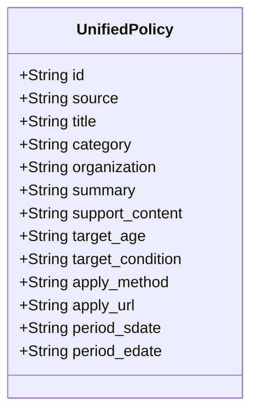
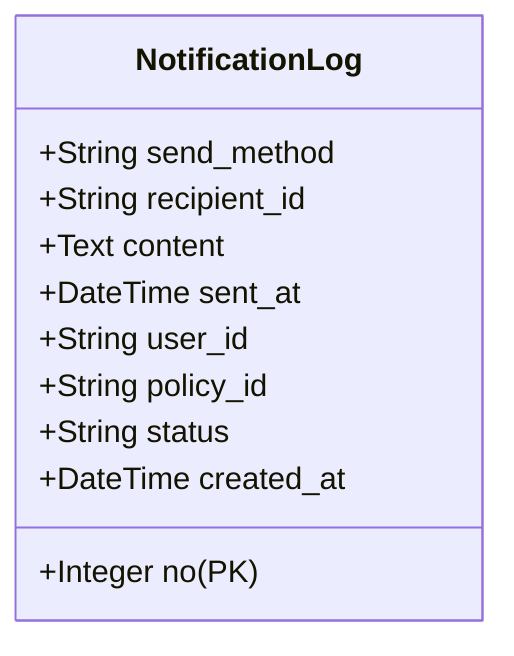

# 📋 청년 정책 및 혜택 통합 데이터 스키마 (Policy Data Schema)

> **문서 버전:** v1.0 (테스트/더미데이터 기준)  
> **기준 파일:** [`dummy_combined_policies.json`](file:///c:/project02/dummy_combined_policies.json)  
> **데이터 출처:** 온통청년 API (`youthcenter.go.kr`) + 공공데이터포털 (`data.go.kr`)  

---

## 1. 스키마 개요

본 스키마는 **온통청년(ONTONG)**과 **공공데이터포털(DATA.GO.KR)**에서 서로 다른 규격으로 제공되는 청년 복지·혜택 데이터를 서비스 화면(UI), 검색/필터링, 데이터베이스(DB)에서 일관되게 다룰 수 있도록 **단일 표준 Policy 모델**로 정규화한 구조입니다.



---

## 2. 필드 상세 정의 (Field Specification)

| 필드명 (Field Name) | 데이터 타입 | 필수 여부 | 설명 (Description) | 예시 값 (Example) |
| :--- | :---: | :---: | :--- | :--- |
| **`id`** | `String` | **필수** | 정책 고유 식별자 (출처 접두사 포함) | `"ONTONG_20260922005400113501"`<br>`"DATA_GO_001"` |
| **`source`** | `String` | **필수** | 데이터 원본 출처 명칭 | `"온통청년 (youthcenter.go.kr)"`<br>`"공공데이터포털 (data.go.kr)"` |
| **`title`** | `String` | **필수** | 정책 및 혜택 명칭 (제목) | `"청년 맞춤형 경제교육 프로그램 개발 및 운영"` |
| **`category`** | `String` | **필수** | 대분류 > 중분류 형태의 카테고리 | `"금융･복지･문화 > 취약계층 및 금융지원"`<br>`"주거 > 월세지원"` |
| **`organization`** | `String` | **필수** | 주관 부처 및 운영 기관명 | `"국토교통부"`, `"재정경제부"`, `"보건복지부"` |
| **`summary`** | `String` | **필수** | 정책 핵심 내용 1~2줄 요약 | `"부모와 별도 거주하는 무주택 청년 대상 실제 납부 임차료 월 최대 20만원 지원"` |
| **`support_content`** | `String` | 선택 | 구체적인 지원 혜택 및 지급 내용 | `"월 최대 20만원 지원 (12회 분할 지급)"` |
| **`target_age`** | `String` | 선택 | 지원 대상 연령 기준 | `"19~25세"`, `"만 19세~34세 무주택 청년"` |
| **`target_condition`**| `String` | 선택 | 소득, 거주지, 취업상태 등 지원 자격 요건 | `"중위소득 60% 이하 (원가구 100% 이하)"` |
| **`apply_method`** | `String` | 선택 | 신청 방법 및 접수 절차 | `"복지로 웹사이트 또는 행정복지센터 방문"` |
| **`apply_url`** | `String` | 선택 | 신청 페이지 바로가기 링크 (URL) | `"https://www.bokjiro.go.kr"` |
| **`keywords`** | `Array[String]` / `String` | 선택 | 정책 핵심 검색 및 AI 분류 키워드 (3개) | `["월세지원", "주거안정", "무주택청년"]`<br>`"월세지원, 주거안정, 무주택청년"` |
| **`period_sdate`** | `String` | 선택 | 정책 신청/시작일 (YYYYMMDD 또는 YYYY-MM-DD, 상시 등) | `"20260727"`, `"2026-07-27"`, `"상시 접수"` |
| **`period_edate`** | `String` | 선택 | 정책 마감/종료일 (YYYYMMDD 또는 YYYY-MM-DD, 상시/예산소진시 등) | `"20260812"`, `"2026-08-12"`, `"20261231"`, `"연중 사업"` |

---

## 3. 데이터 출처별 매핑 규칙

### 1) 온통청년 API (`https://www.youthcenter.go.kr/go/ythip/getPlcy`)
* **ID 생성:** `ONTONG_` + 원본 `plcyNo` (예: `ONTONG_20260922005400113501`)
* **카테고리:** `{lclsfNm} > {mclsfNm}` 형태로 조합
* **기관:** `sprvsnInstCdNm` (주관기관) 우선 매핑, 없을 경우 `operInstCdNm` (운영기관)
* **연령:** `sprtTrgtMinAge` ~ `sprtTrgtMaxAge` 조합
* **기간 분리:** 
  - `period_sdate`: 신청기간(`rqutPrdCn`) 또는 사업기간(`bizPrdCn`)의 시작일 추출
  - `period_edate`: 신청기간(`rqutPrdCn`) 또는 사업기간(`bizPrdCn`)의 마감/종료일 추출

### 2) 공공데이터포털 (`data.go.kr` - 복지로/보조금24 등)
* **ID 생성:** `DATA_GO_` + 3자리 순번 (예: `DATA_GO_001`)
* **카테고리:** 복지 분야별 분류 (주거, 금융, 일자리, 문화, 교육 등)
* **주관기관:** 담당 정부 부처명 (보건복지부, 금융위원회, 국토교통부 등)
* **기간 분리:**
  - `period_sdate`: 신청/접수 시작일자 (상시인 경우 `"상시 접수"`)
  - `period_edate`: 마감일자 (연중/예산 소진 시까지 등)

---

## 4. JSON 데이터 샘플 (Data Samples)

### 🔹 [샘플 1] 온통청년 데이터
```json
{
  "id": "ONTONG_20260922005400113501",
  "source": "온통청년 (youthcenter.go.kr)",
  "title": "청년 맞춤형 경제교육 프로그램 개발 및 운영",
  "category": "금융･복지･문화 > 취약계층 및 금융지원",
  "organization": "재정경제부 기획조정실 정책기획관",
  "summary": "청년대상 체험형 경제캠프 운영 및 생애주기별 맞춤형 경제교육 컨텐츠 제작을 통해 경제환경을 이해하고, 경제적 사고력 함양",
  "support_content": "(경제캠프 운영) 토론·팀 활동·실습 등 참여형 프로그램을 통해 급변하는 경제환경을 이해하고 실생활에 적용...",
  "target_age": "19~25세",
  "target_condition": "해당 연령 청년 대상",
  "apply_method": "(경제캠프) www.econcamp.re.kr 에서 신청접수",
  "apply_url": "https://www.econcamp.re.kr/",
  "period_sdate": "20260727",
  "period_edate": "20260812"
}
```

### 🔹 [샘플 2] 공공데이터포털 데이터
```json
{
  "id": "DATA_GO_001",
  "source": "공공데이터포털 (data.go.kr)",
  "title": "청년월세 한시 특별지원",
  "category": "주거 > 월세지원",
  "organization": "국토교통부",
  "summary": "부모와 별도 거주하는 무주택 청년 대상 실제 납부 임차료 월 최대 20만원(최대 12개월) 지원",
  "support_content": "월 최대 20만원 지원 (12회 분할 지급)",
  "target_age": "만 19세~34세 무주택 청년",
  "target_condition": "중위소득 60% 이하 (원가구 100% 이하)",
  "apply_method": "복지로 웹사이트 또는 행정복지센터 방문",
  "apply_url": "https://www.bokjiro.go.kr",
  "period_sdate": "상시 접수",
  "period_edate": "연중 사업"
}
```

---

## 5. 프론트엔드 / 백엔드 활용 권장사항

1. **검색 및 기간 필터링/정렬:**
   - 카테고리 필터: `category` 앞부분(대분류)을 분리하여 '주거', '금융', '일자리', '교육', '복지' 필터 버튼 구현 가능
   - 연령 맞춤 필터: `target_age`에서 숫자 파싱을 통해 사용자 입력 나이에 맞는 정책 필터링 가능
   - 마감일순 정렬 및 D-Day 계산: `period_edate` 값을 기준으로 오늘 날짜와 비교하여 D-Day 계산 및 마감임박순 정렬 용이
   - 캘린더/일정 뷰: `period_sdate`와 `period_edate` 범위를 기반으로 캘린더 내 정책 일정 표시 가능
2. **UI 카드 컴포넌트 표시:**
   - 카드 상단 뱃지: `category` 및 `source`
   - 카드 제목: `title`
   - 본문 요약: `summary`
   - 기간 표시: `period_sdate` ~ `period_edate` (예: "2026.07.27 ~ 2026.08.12" 또는 "상시 접수")
   - 하단 버튼: `apply_url` 연결 ("자세히 보기 / 신청하기")
3. **향후 확장 가능 필드 (추천):**
   - `region`: 지자체/지역별 정책 구분 (`"전국"`, `"서울"`, `"부산"` 등)
   - `views_count`: 조회수 / 북마크수
   - `is_active`: 현재 접수 진행 여부 (`true` / `false`)

---

## 6. 알림 및 메시지 발송 기록 스키마 (`notification_logs`)

텔레그램 또는 이메일로 정책 알림을 발송하거나 테스트를 진행할 때, 발송된 **내용(content)**, **보낸 아이디/이메일(recipient_id)**, **발송 일시(sent_at)**를 DB에 저장합니다.



| 필드명 (Column) | 데이터 타입 | 제약 조건 | 설명 |
| :--- | :---: | :---: | :--- |
| **`no`** | `INTEGER / SERIAL` | `PRIMARY KEY`, `AUTO_INCREMENT` | 고유 발송 식별 번호 (PK) |
| **`send_method`** | `VARCHAR(20)` | `NOT NULL`, `INDEX` | 발송 수단 (`telegram` / `email` / `system`) |
| **`recipient_id`** | `VARCHAR(255)` | `NOT NULL`, `INDEX` | 수신자 식별자 (텔레그램 ID 또는 이메일 주소) |
| **`content`** | `TEXT` | `NOT NULL` | 발송된 알림 메시지 본문 내용 |
| **`sent_at`** | `TIMESTAMP WITH TIME ZONE` | `NOT NULL`, `INDEX` | 발송 완료 일시 (날짜/시간) |
| **`user_id`** | `VARCHAR(50)` | `NULLABLE`, `FK -> users.id` | 연계 사용자 ID |
| **`policy_id`** | `VARCHAR(50)` | `NULLABLE`, `FK -> policies.id` | 연계 정책 ID |
| **`status`** | `VARCHAR(20)` | `DEFAULT 'SENT'` | 발송 상태 (`SENT`, `REGISTERED`, `SUCCESS`, `FAILED`) |

